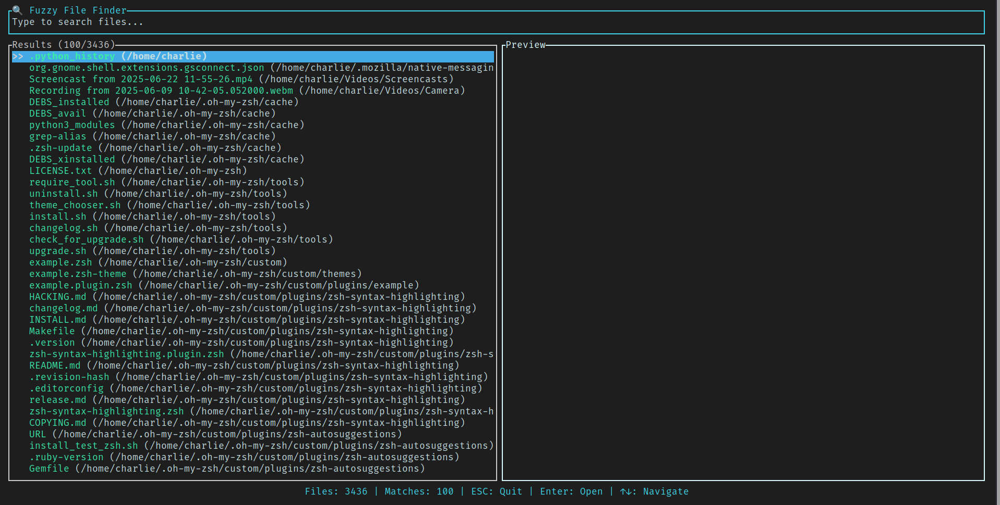
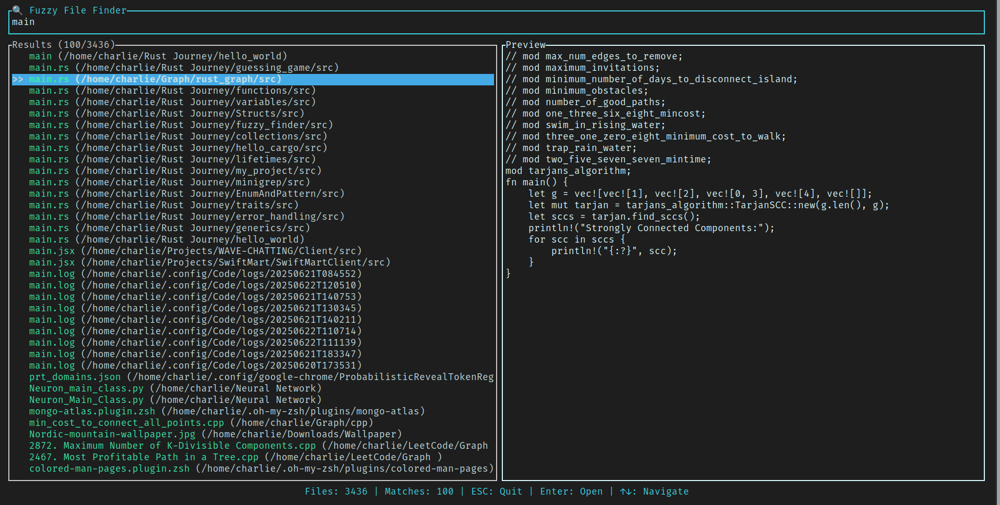

# 🔍 Fuzzy Finder

**Fuzzy Finder** is a fast and lightweight terminal-based file searcher built in Rust.
It provides a blazing-fast fuzzy search over your filesystem using an interactive TUI, allowing users to locate and open files without needing full filenames.

---

## 🎬 Demo

<p align="center">
  
</p>

---

## 🚀 Features

- 🔍 Real-time fuzzy search over your entire file system
- ⚡ Blazingly fast performance using parallelism [`rayon`](http://crates.io/crates/rayon)
- 🎯 Live filtering with regex-based partial matches
- 🖥️ Minimal and responsive terminal UI built with [`ratatui`](https://crates.io/crates/ratatui)
- 🧭 Keyboard navigation (↑/↓) and file opening (Enter)
- 🧱 Cross-platform support (Linux, macOS, Windows)

---

## 📦 Installation

> Requires Rust ≥ 1.70

1.  **Clone the repository and build from source**
    ```bash
    git clone https://github.com/Unemployed2025/fuzzy-finder.git
    cd fuzzy-finder
    cargo build --release
    ```
    This creates the binary at: `target/release/fuzzy-finder`

2.  **Move the binary to your system PATH**

    Choose a directory already in your `$PATH`, or add a new one:
    ```bash
    mkdir -p ~/.local/bin
    cp target/release/fuzzy-finder ~/.local/bin/
    chmod +x ~/.local/bin/fuzzy-finder
    ```
    Then add this line to your shell config (e.g. `~/.zshrc`, `~/.bashrc`):
    ```bash
    export PATH="$HOME/.local/bin:$PATH"
    ```
    Reload your shell:
    ```bash
    source ~/.zshrc  # or ~/.bashrc
    ```

3.  **(Optional) Add a shortcut**

    To use a shorter command, add the following alias to your shell config to make it persistent:
    ```bash
    alias fzfinder="fuzzy-finder"
    ```

---

## 🧑‍💻 Usage

Launch the fuzzy finder from your terminal:
```bash
fzfinder
```
Then:
- Start typing to filter files
- Use <kbd>↑</kbd> / <kbd>↓</kbd> to navigate
- Press <kbd>Enter</kbd> to open the selected file
- Press <kbd>Esc</kbd> or <kbd>Ctrl</kbd>+<kbd>C</kbd> to exit

---

## 🧰 Customization

| Key Binding                      | Action              |
| -------------------------------- | ------------------- |
| Type keywords                    | Live fuzzy filter   |
| <kbd>↑</kbd> / <kbd>↓</kbd>       | Move selection      |
| <kbd>Enter</kbd>                 | Open selected file  |
| <kbd>ESC</kbd> / <kbd>Ctrl</kbd>+<kbd>C</kbd> | Exit application    |

---

## 📁 How It Works

- Scans the filesystem recursively (starting from your home directory)
- Collects up to a preset number of files (configurable)
- Applies case-insensitive regex matching
- Renders matching results in a scrollable TUI

---

## 🔧 Dependencies

- [`ratatui`](https://crates.io/crates/ratatui) – TUI rendering
- [`crossterm`](https://crates.io/crates/crossterm) – Terminal events
- [`regex`](https://crates.io/crates/regex) – Fuzzy matching
- [`walkdir`](https://crates.io/crates/walkdir) – Directory traversal
- [`rayon`](https://crates.io/crates/rayon) – Parallel filtering
- [`dirs`](https://crates.io/crates/dirs) – Home directory discovery

You can install them via:
```bash
cargo add ratatui crossterm regex walkdir rayon dirs
```

---

## 🛣 Roadmap

- [x] Basic fuzzy search
- [x] TUI interface
- [x] File opener
- [ ] File type filters
- [ ] Customizable search scope
- [ ] File preview panel
- [ ] Plugin support (Zsh/Fish)

---
## 🖼️ Screenshots

#### 🔎 Search Prompt
<p align="center">
    
</p>

#### 📄 Search Results
<p align="center">
    
</p>

---

## 🙌 Acknowledgements

Inspired by tools like `fzf` and `skim`, but built entirely in Rust for better integration and learning.